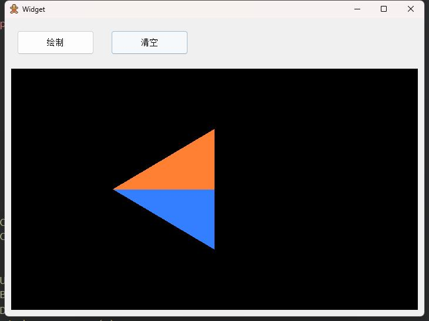

## Chapter One


-   >   Q: 
    >
    >   为什么这样操作就能创建一个BUFFER对象，VBO不是整形变量吗？
    >
    >   ```c++
    >   GLuint VBO;
    >   glGenBuffers(1, &VBO);
    >   glBindBuffer(GL_ARRAY_BUFFER, VBO); 
    >   ```
    >
    >   A:
    >
    >   ```tex
    >   在OpenGL中，使用整型变量来表示和操作缓冲区对象（Buffer Object）。
    >   glGenBuffers 函数用于生成一个或多个缓冲区对象的名称，并将其存储在指定的整型变量中。在这里，VBO 是一个整型变量，用于存储生成的缓冲区对象的名称。
    >   glBindBuffer 函数用于将指定的缓冲区对象绑定到指定的目标（例如 GL_ARRAY_BUFFER）。在这里，VBO 存储的缓冲区对象名称将被绑定到 GL_ARRAY_BUFFER 目标上。
    >   通过这样的操作，我们就可以创建一个缓冲区对象，并将其绑定到 GL_ARRAY_BUFFER 目标上，以便后续的操作可以针对该缓冲区对象进行。
    >   ```
    >
    >   Q: 
    >
    >   `VBO`的实际数值是不是代表的地址？
    >
    >   A:
    >
    >   ```tex
    >   不是，VBO 的实际数值并不代表地址。在OpenGL中，VBO 是一个无符号整型变量，用于表示缓冲区对象的名称（ID）。这个名称是由OpenGL生成的，它只是一个标识符，用于引用和操作缓冲区对象。
    >   VBO 的数值实际上是一个唯一的标识符，用于在OpenGL内部识别和管理缓冲区对象。这个数值并不代表内存地址或者其他实际的物理存储位置。在使用VBO时，我们通过将其绑定到特定的目标上，来告诉OpenGL我们要操作的是哪个缓冲区对象。OpenGL根据VBO的数值来查找并操作对应的缓冲区对象。
    >   ```
    >
    >   Q: 
    >
    >   `glGenBuffers(1, &VBO);`这里的第一个参数1代表什么意思？
    >
    >   A: 
    >
    >   ```tex
    >   在 glGenBuffers 函数中，第一个参数表示要生成的缓冲区对象的数量。在这种情况下，传递的值为1，表示我们要生成一个缓冲区对象。
    >   这个参数告诉OpenGL要生成多少个缓冲区对象的名称，并将这些名称存储在后续的参数中。在这里，我们只需要一个缓冲区对象，所以传递的值是1。如果我们需要生成多个缓冲区对象的名称，可以将这个参数的值相应地设置为大于1的数值。
    >   注意，生成缓冲区对象的名称并不会立即分配实际的缓冲区内存，它只是为我们提供一个标识符，用于引用和操作缓冲区对象。实际的内存分配发生在后续的操作中，例如通过 glBufferData 函数将数据传递给缓冲区对象。
    >   ```
    >
    >   

-   >   Q:
    >
    >   ```c++
    >   // 创建VAO对象，并赋予ID
    >   glGenVertexArrays(1, &VAO);
    >   // 使用VAO对象上
    >   glBindVertexArray(VAO);
    >   //告知显卡如何解析缓冲区里的属性值
    >   glVertexAttribPointer(0, 3, GL_FLOAT, GL_FALSE, 3 * sizeof(float),
    >                         static_cast<GLvoid*>(0));//开启VAO管理第一个属性值
    >   // 启动location = 0的顶点
    >   glEnableVertexAttribArray(0);
    >   ```
    >
    >   其中VAO的主要作用到底是什么？工作原理是什么？
    >
    >   A:
    >
    >   -   VAO的作用
    >
    >       >   VAO，全称为Vertex Array Object，即顶点数组对象。在OpenGL中，VAO是用来存储所有关于顶点属性的配置的。这包括glVertexAttribPointer调用的设置，以及与这些属性相关的顶点缓冲对象。这样的设计使得我们可以通过绑定不同的VAO，来切换不同的顶点数据和属性配置。
    >
    >   -   VAO的工作原理
    >
    >       >   当你创建一个VAO并绑定它之后，任何之后的顶点属性配置都会存储在这个VAO中。这包括任何调用glVertexAttribPointer的设置，以及通过glEnableVertexAttribArray和glDisableVertexAttribArray启用和禁用顶点属性数组。这意味着，VAO已经存储了所有需要渲染对象所需的信息。当我们需要绘制对象时，只需要绑定相应的VAO，OpenGL就会使用VAO中的所有配置。这样，我们就可以通过切换不同的VAO，来切换不同的顶点缓冲对象和属性配置，从而绘制出不同的对象。
    >
    >   -   VAO的优点
    >
    >       >   使用VAO的主要优点是可以减少绘制对象所需的设置次数。如果没有VAO，每次绘制对象时，我们都需要重新设置所有的顶点属性。但是有了VAO，我们只需要在创建对象时设置一次，然后在绘制时只需要绑定相应的VAO即可。这样不仅可以简化代码，还可以提高效率。总的来说，VAO的主要作用是存储顶点属性配置，使得我们可以通过切换不同的VAO，来切换不同的顶点数据和属性配置，从而绘制出不同的对象。
    >
    >   -   VAO中记录的信息状态
    >
    >   -   >   1.   glEnableVertexAttribArray和glDisableVertexAttribArray的调用。
    >       >   2.   通过glVertexAttribPointer设置的顶点属性配置。
    >       >   3.   通过glVertexAttribPointer调用与顶点属性关联的顶点缓冲对象。


-   Chapter One question1

    

-   Chapter One question2

    

-   Chapter One question3

    


## Chapter Two
